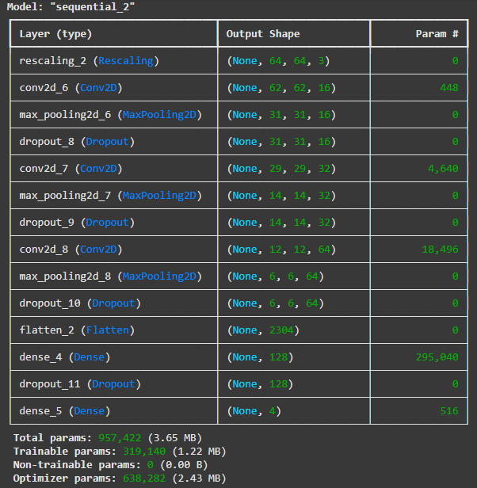
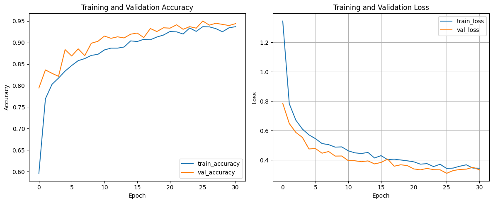

# Classificação de Tumores Cerebrais usando CNN customizada

Este repositório contém o código para um modelo de classificação de imagens baseado em Redes Neurais Convolucionais (CNNs) projetado para classificar imagens de ressonância magnética (RM) de cérebros para detectar a presença e o tipo de tumor cerebral. O modelo foi desenvolvido utilizando TensorFlow/Keras.

## Dataset

O modelo foi treinado e avaliado utilizando o dataset "[Brain Tumor MRI Dataset](https://www.kaggle.com/masoudnickparvar/brain-tumor-mri-dataset)" disponível no Kaggle. Este dataset contém imagens de RM cerebrais categorizadas em 4 classes:

*   Sem tumor
*   Glioma 
*   Meningioma
*   Pituitary

O dataset original foi dividido em conjuntos de treino, validação e teste utilizando a biblioteca scikit-learn para a divisão treino/validação, e o conjunto de teste separado fornecido no dataset.

## Arquitetura do Modelo

A arquitetura da CNN utilizada consiste em:

*   Camada de Entrada com Data Augmentation e Rescaling para uso opcional.
*   Múltiplas camadas convolucionais com ativação ReLU, seguidas por camadas de Max Pooling para redução dimensional e camadas de Dropout para regularização.
*   Uma camada Flatten para converter a saída das camadas convolucionais em um vetor.
*   Uma camada Dense (Totalmente Conectada) com ativação ReLU e regularização L2.
*   Uma camada de saída Dense com 4 unidades (correspondentes às 4 classes) e ativação Softmax para obter as probabilidades de classe.

A compilação do modelo utiliza a função de perda `categorical_crossentropy` e o otimizador Adam com uma taxa de aprendizado ajustável.

Configuração da rede:

## Treinamento

1.  O conjunto de treino original foi dividido em subconjuntos de treino (80%) e validação (20%) usando `train_test_split` da biblioteca scikit-learn, mantendo a proporção das classes.
2.  O conjunto de teste foi utilizado separadamente para avaliação final.
3.  O modelo final foi treinado no conjunto de treino sem Data Augmentation.
4.  O treinamento utilizou callbacks como Early Stopping (monitorando a perda de validação) e ReduceLROnPlateau para ajustar a taxa de aprendizado.
5.  O melhor modelo (com menor perda de validação) foi salvo automaticamente durante o treinamento.

## Resultados

O gráfico abaixo mostra a evolução da acurácia e da perda durante as épocas de treinamento e validação:

Após o treinamento, o modelo foi avaliado no conjunto de teste, apresentando os seguintes resultados:

*   **Loss no teste:** 0.3393
*   **Acurácia no teste:** 0.9390 (93.9%)
*   **Precisão no teste:** 0.9418 (94.18%)
*   **Recall no teste:** 0.9382 (93.82%)

## Como Usar

1.  Clone este repositório.
2.  Faça o download ou importe o dataset "[Brain Tumor MRI Dataset](https://www.kaggle.com/masoudnickparvar/brain-tumor-mri-dataset)" do Kaggle.
3.  Organize o dataset no formato esperado pelo código (pastas "Training" e "Testing" com subpastas para cada classe).
4.  Configure o ambiente com as dependências necessárias (ver seção Dependências).
5.  Execute o script ou notebook para carregar os dados, treinar o modelo e avaliar os resultados.
6.  O melhor modelo treinado será salvo no caminho configurado para posteriores inferências ou análises.

## Dependências

*   TensorFlow
*   Keras
*   NumPy
*   Matplotlib
*   Scikit-learn
*   Kagglehub (para download do dataset)

